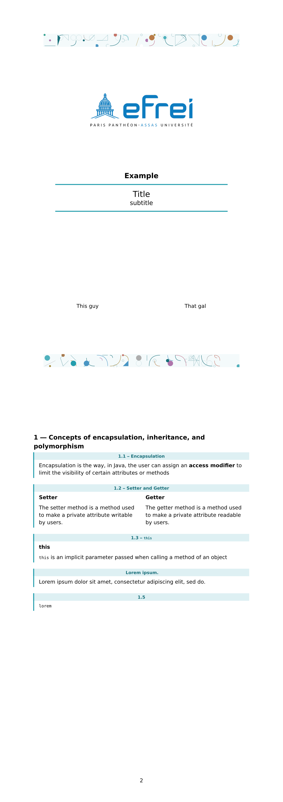

# typst_efrei_template
A port of my [LaTeX report card template](https://github.com/avivi55/report_card_template) in ✨Typst✨

After a long battle with LaTeX3, I resign myself to use Typst.



This template has all the same problems as the aforementioned LaTeX implementation.
The courses are hardcoded in a dictionary in the template. 
But there is a way of putting your own :

```rust
#show: report.with(
  title: [Title],
  subtitle: [subtitle],
  subject: (name: "Example", color: teal),
  authors: ("Me", "you", "him"),
)
```
The color is a base from which the header and background color of the `#question` function are derived.

It gives the same two functions as the old package.

(it uses the `arev` font by default)